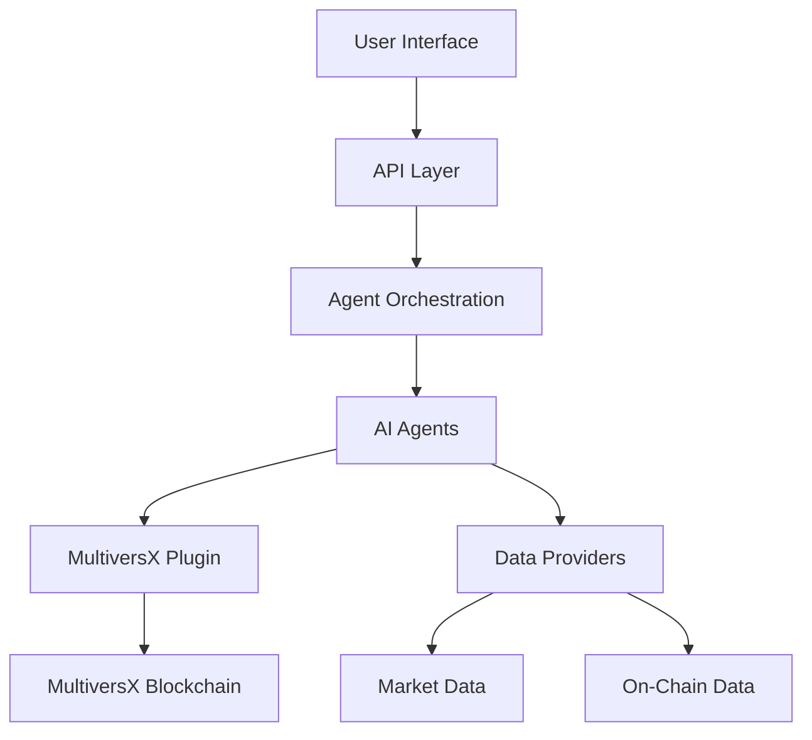

# System Overview

Let's take a look at how HiveX works under the hood. Our system combines AI agents, blockchain integration, and a user-friendly interface to create a seamless DeFi experience on MultiversX. This overview will help you understand how all the pieces fit together.

## System Architecture

HiveX is built with a modular architecture that separates concerns while enabling powerful interactions between components:

### Key Components

1. **User Interface**
   - Web application built with Next.js
   - Mobile-responsive design
   - Chat interface for agent interaction
   - Dashboard for portfolio and market data

2. **API Layer**
   - RESTful API endpoints
   - WebSocket connections for real-time updates
   - Authentication and security middleware
   - Request routing and validation

3. **Agent Orchestration**
   - n8n workflows for agent coordination
   - Task delegation and management
   - Response aggregation
   - Error handling and recovery

4. **AI Agents**
   - Specialized agents for different tasks
   - Natural language processing
   - Context management
   - Knowledge retrieval

5. **MultiversX Plugin**
   - Blockchain interaction layer
   - Wallet management
   - Transaction creation and signing
   - Smart contract interaction

6. **Data Providers**
   - Market data integration (CoinGecko, DefiLlama)
   - On-chain data retrieval
   - Historical data analysis
   - Real-time price feeds

## Data Flow

1. **User Input**
   - User sends a request via chat or UI interaction
   - Request is processed and routed to the appropriate agent(s)

2. **Agent Processing**
   - Agent analyzes the request using NLP
   - Relevant information is retrieved from knowledge base
   - Agent determines required actions

3. **Blockchain Interaction**
   - If needed, the agent uses the MultiversX plugin to interact with the blockchain
   - Transactions are created, signed, and broadcast
   - Results are monitored and verified

4. **Response Generation**
   - Agent formulates a response based on action results
   - Response is formatted for user consumption
   - Additional context or suggestions may be added

5. **User Feedback**
   - Response is delivered to the user
   - User can provide feedback or follow-up questions
   - System learns from interactions to improve future responses

## Technical Stack

- **Frontend**: Next.js, React, TypeScript
- **Backend**: Node.js, Express
- **AI**: OpenAI API, Retrieval-Augmented Generation (RAG)
- **Orchestration**: n8n, ElizaOS
- **Blockchain**: MultiversX SDK, xExchange SDK, AshSwap SDK
- **Data**: CoinGecko API, DefiLlama API, MultiversX API

## Security Considerations

- Private keys are never exposed to agents
- All blockchain transactions require explicit user approval
- API keys are securely stored and managed
- Rate limiting and request validation prevent abuse
- Regular security audits and updates

## Extensibility

HiveX is designed to be easily extended:
- New agents can be added to the system
- Additional data providers can be integrated
- The MultiversX plugin can be enhanced with new capabilities
- Custom workflows can be created in n8n

For more detailed information about specific components, check out our [Multi-Agent System](./multi-agent-system.md) documentation, [Plugin](./plugin.md) details, or [n8n Workflows](./n8n.md) guide.
